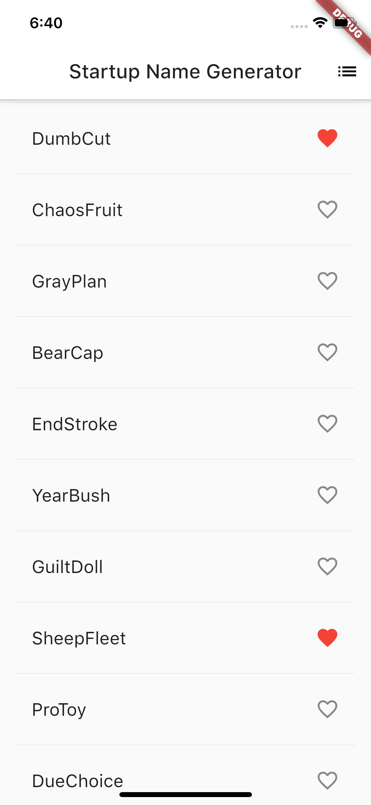

# Names Generator
## VD Flutter Training - Session 5

This app extends the *names_generator* app built in Flutter [getting started tutorial](https://flutter.dev/docs/get-started/codelab) and adds local storage to it for persisting favorite names list between sessions.

### Description

Uses *path_provider* plugin for local file storage.

## Application

